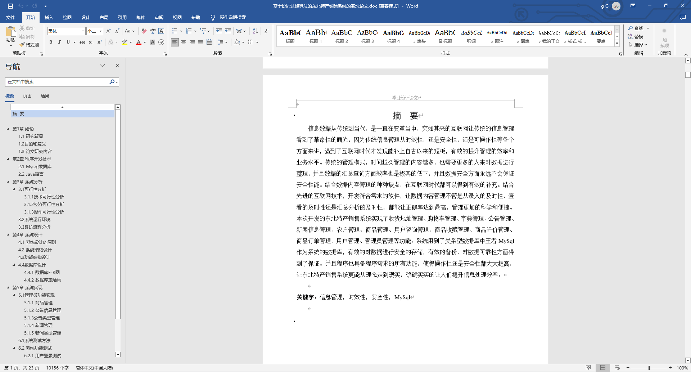
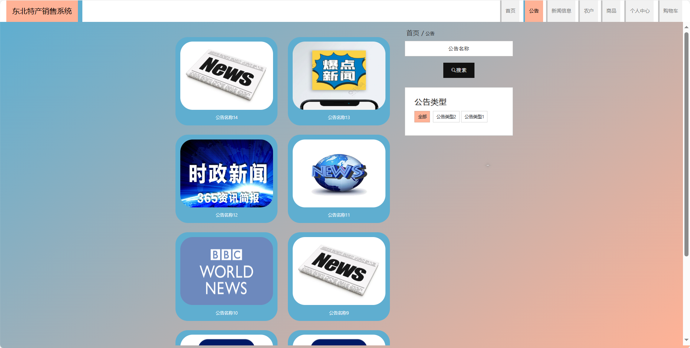
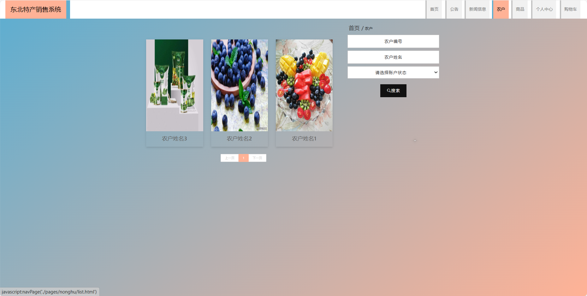
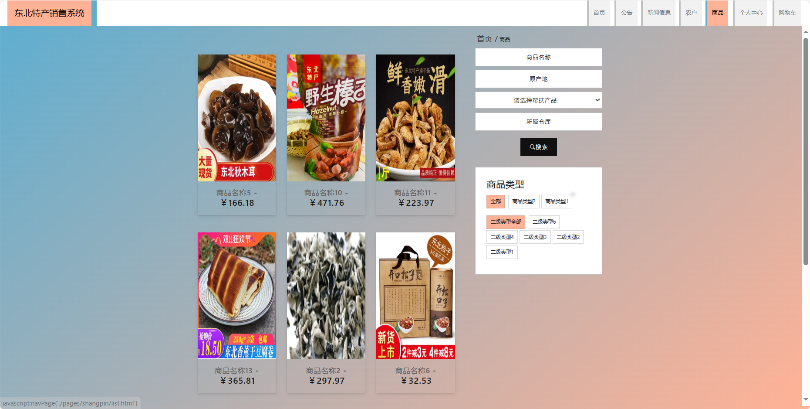
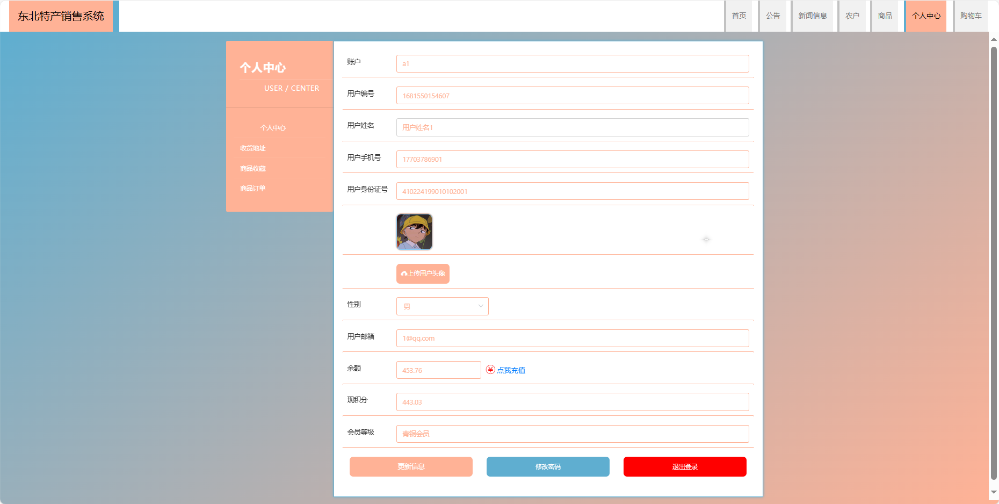
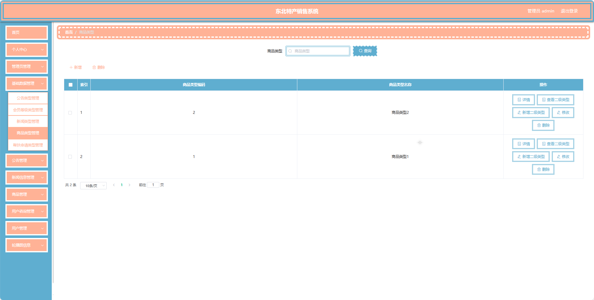
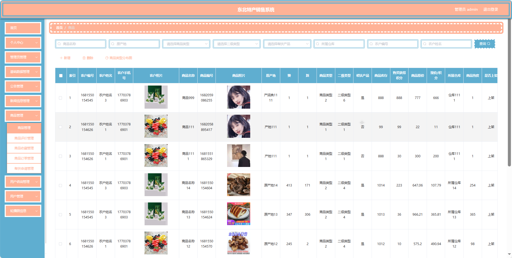
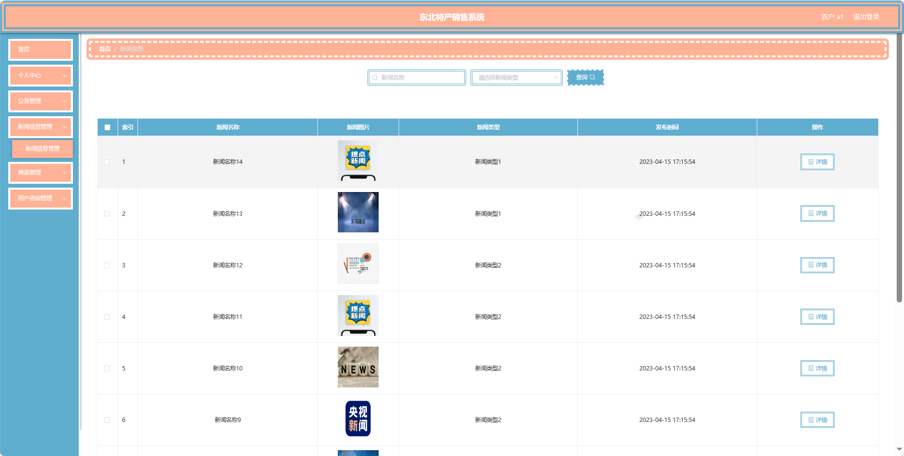

## 基于SpringBoot的东北特产销售系统(程序+报告)

###  获取sql数据库文件: 从戎源码网 (https://armycodes.com/) QQ: 386869957 QQ群: 377586148
###  所有系统地址: (https://github.com/YuLin-Coder/AllProjectCatalog) 
###  所有项目以及源代码本人均调试运行无问题 可支持远程安装部署调试、定制修改、代码讲解

## 项目介绍
基于SpringBoot的东北特产销售系统，系统包含三种角色：管理员、用户,农户主要功能如下。

### 【管理员】:
1. **首页：** 查看销售系统整体概况。
2. **个人中心：** 修改密码、管理个人信息。
3. **管理员管理：** 审核和管理注册管理员用户的信息。
4. **基础数据管理：** 管理系统的基础数据，包括公告类型、会员等级类型、新闻类型、商品类型和帮扶申请类型等。
5. **公告管理：** 发布、编辑和删除系统的通知和公告。
6. **新闻信息管理：** 发布、编辑和删除关于东北特产的新闻信息。
7. **商品管理：** 管理特产商品的信息，包括商品基本信息、评价、收藏、订单和帮扶申请等。
8. **用户咨询管理：** 查看和管理用户对特产商品的咨询信息。
9. **用户管理：** 审核和管理注册用户的信息。
10. **农户管理：** 管理注册的农户信息。
11. **轮播图信息：** 管理销售系统首页的轮播图。

### 【农户功能】
1. **首页：** 查看东北特产销售系统。
2. **个人中心：** 修改密码、管理个人信息。
3. **公告管理：** 发布、编辑和删除关于农户自身的公告信息。
4. **新闻信息管理：** 发布、编辑和删除关于农户自身的新闻信息。
5. **商品管理：** 管理农户提供的特产商品信息，包括商品基本信息、评价、订单和帮扶申请等。
6. **用户咨询管理：** 查看和管理用户对农户商品的咨询信息。

### 【用户】:
1. **首页：** 浏览东北特产销售系统的主要信息。
2. **公告：** 查看系统发布的重要通知和公告。
3. **新闻信息：** 阅读有关东北特产的最新新闻和信息。
4. **农户：** 浏览和搜索各个农户提供的特产信息。
5. **商品：** 浏览系统中各类特产商品。
6. **个人中心：** 管理个人信息，查看购物车中的商品。
7. **购物车：** 查看已选购的商品，进行结算和下单。

## 项目技术
- 编程语言：Java
- 数据库：MySQL
- 项目管理工具：Maven
- 前端技术：HTML、CSS、JavaScript、Jquery、Vue
- 后端技术：Spring、SpringMVC、MyBatis

## 运行环境
- JDK版本：JDK1.8及以上
- 开发工具：IDEA、Ecplise、Myecplise都可以
- 数据库: MySQL5.7及以上
- Maven：maven3.0及以上
- Node：14.14.0及以上

## 运行截图

